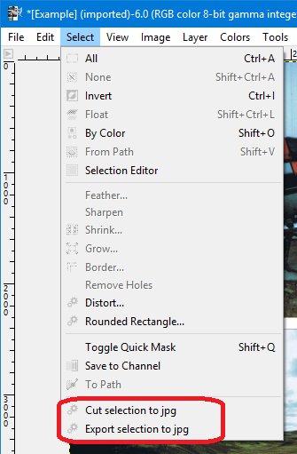
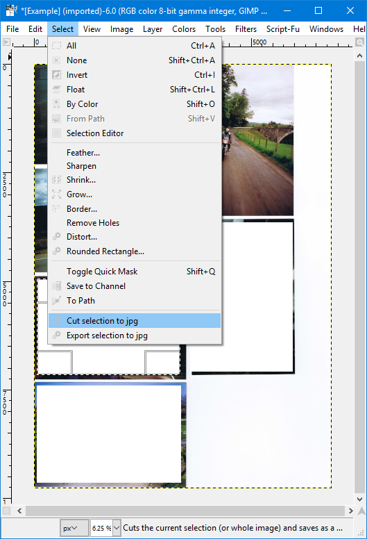
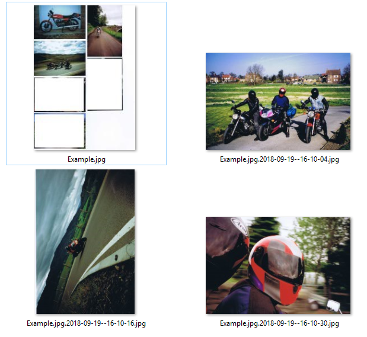
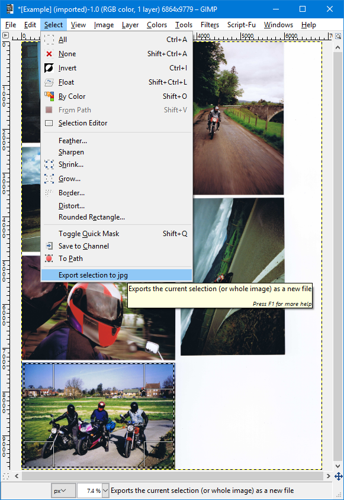
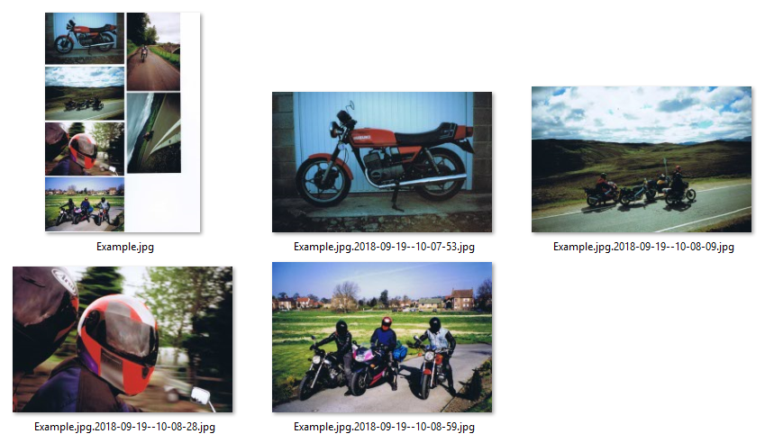

# GimpPlugins v1.0
Tested on gimp 2.8 Windows.

# Install

 Place python files in gimp plug-ins folder (e.g. `%userprofile%\.gimp-2.8\plug-ins`) and restart Gimp.

 Note: No need to restart Gimp if code changed unless you change the registration.

 # Plugins

 ## cut_selection_to_jpg.py  

 Ideal for use when scanning multiple photographs and splitting them while tracking which ones you have done.

 1. Select part of an image
 2. Menu > Select > Cut selection to jpg  

 3. A new jpg file is created on disk based on the original file name and the time the export occurred  
 

 ## export_selection_to_jpg.py  

 Ideal for use when scanning multiple photographs and splitting them.

 1. Select part of an image
 2. Menu > Select > Export selection to jpg  

 3. A new jpg file is created on disk based on the original file name and the time the export occurred  
 
